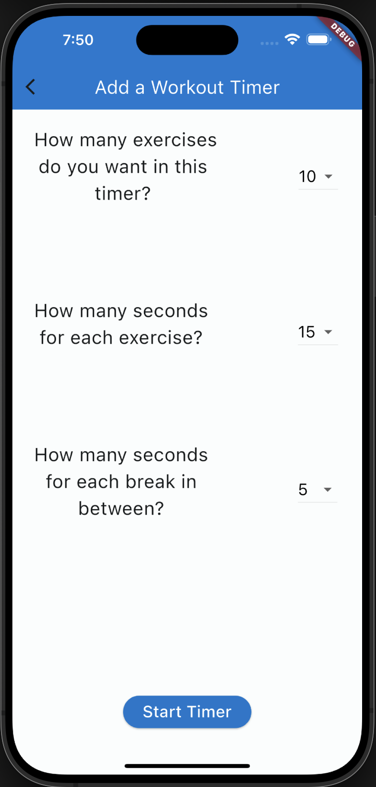

# Workout Timer 

####

A mobile application that takes in user input to customize the timer duration and repetition based on workout needs, built with Dart and Flutter.

## Demo

####

  

## Screenshots

####

&nbsp;&nbsp;&nbsp;&nbsp;&nbsp;&nbsp;&nbsp;&nbsp;&nbsp;&nbsp;&nbsp;&nbsp;&nbsp;&nbsp;&nbsp;&nbsp;&nbsp;&nbsp;&nbsp;&nbsp;&nbsp;&nbsp;&nbsp;&nbsp;
Home Page 
&nbsp;&nbsp;&nbsp;&nbsp;&nbsp;&nbsp;&nbsp;&nbsp;&nbsp;&nbsp;&nbsp;&nbsp;&nbsp;&nbsp;&nbsp;&nbsp;&nbsp;&nbsp;&nbsp;&nbsp;&nbsp;&nbsp;&nbsp;&nbsp;
&nbsp;&nbsp;&nbsp;&nbsp;&nbsp;&nbsp;&nbsp;&nbsp;&nbsp;&nbsp;&nbsp;&nbsp;&nbsp;&nbsp;&nbsp;&nbsp;&nbsp;&nbsp;&nbsp;&nbsp;&nbsp;&nbsp;&nbsp;&nbsp;&nbsp;Add Timer Page

## Installation and Setup Instructions

####  

Clone down this repository. You will need `Flutter SDK` and `Xcode` installed on your machine.  

Verify Flutter is Ready:

`flutter doctor`  

Open Simulator:  

`open -a simulator`  

To Start Project:

`flutter run`  

## Reflection

####

This was a 2-week long personal project aimed to familiarize myself with building mobile apps. I was inspired to create this timer app because the functionality is something I wanted to use in my daily life. Project goals included becoming skilled at using the Flutter framework and learning a new programming language, Dart.

One of the main obstacles I ran into was adding sound. The current audio plugin, audioplayers, had some bugs that weren't allowing me to play sound effects. Ultimately, I had to upgrade the plugin to audioplayers 5.2.1 to get the sound to work. I learned to inspect and configure the pubspec.yaml because of this hurdle.

I chose to work with the open source framework, Flutter because it is growing in popularity and I wanted to challenge myself by developing my app in Dart, a language I hadn't used before. Flutter is a good framework to learn because it is applicable to both Android and IOS. I gained experience in setting up an SDK, configuring plugins and designing pages for a mobile app.

